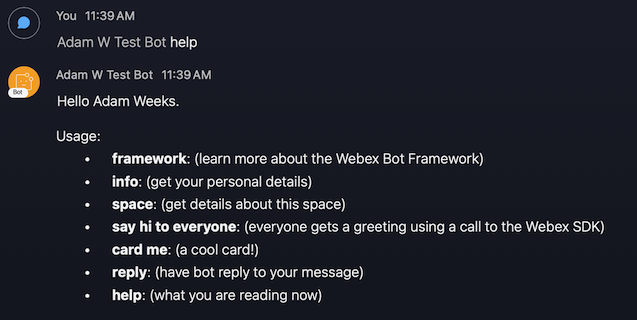

# Webex-Bot-Snowflake-Cortex-Analyst

### webex bot Starter kit and template for a snowflake cortex analyst

---

## Steps to get the simple webex bot working

1. Create a Webex bot (save the API access token and username): https://developer.webex.com/my-apps/new/bot
1. Rename `.env.local` to `.env`

1. Edit `.env` with the following values:

- BOTTOKEN - Set this to the token for your bot that you got in step 1

1. Turn on your bot server with `npm start`

1. Create a space in Webex

1. Add the bot (by its username) to the space in Webex

1. @ mention your bot with `help` to get your first response: `@mybotname help`

## Optional: Webhooks

The [webex-node-bot-framework](https://github.com/WebexCommunity/webex-node-bot-framework) supports WebSockets by default. If you would prefer your bot to operate via [Webhooks](https://developer.webex.com/docs/api/guides/webhooks), use these steps.

1. Sign up for nGrok, then connect and start it on your machine (save the port number and public web address): https://ngrok.com/download

1. After installing ngrok, run it on your local machine to get a public ip address, eg `ngrok http 3000 --region=eu`

1. Copy the ip address displayed in the ngrok window, ie: : https://1234.eu.ngrok.io

1. Edit `.env` with the following values:

- PORT - Set this to the port you set when you started ngrok
- WEBHOOKURL - Set this to the ip address that you copied

## Steps to integrate cortex analyst in webex bot
1. Login to your snowflake account. If you do not have one, create free account from [here](https://signup.snowflake.com/?utm_cta=trial-en-www-homepage-top-right-nav-ss-evg&_ga=2.55182251.1247825864.1741244127-768819658.1703016241)
1. Run setup.sql from data folder
1. Load 3 csv files to newly created tables
1. Upload revenue_timeseries.yaml file to new create mystage location inside your CORTEXANALYST schema
1. Data setup is completed

## Steps to create key pair authentication for snowflake
Snowflake supports using key pair authentication for enhanced authentication security as an alternative to basic authentication, such as username and password. For this demo setup I recommend creating key pair authentication, please follow the documents to complete key pair setup. [Key Pair Auth](https://docs.snowflake.com/en/user-guide/key-pair-auth#generate-the-private-key)

Please open .env file and fill out all the variables before testing.